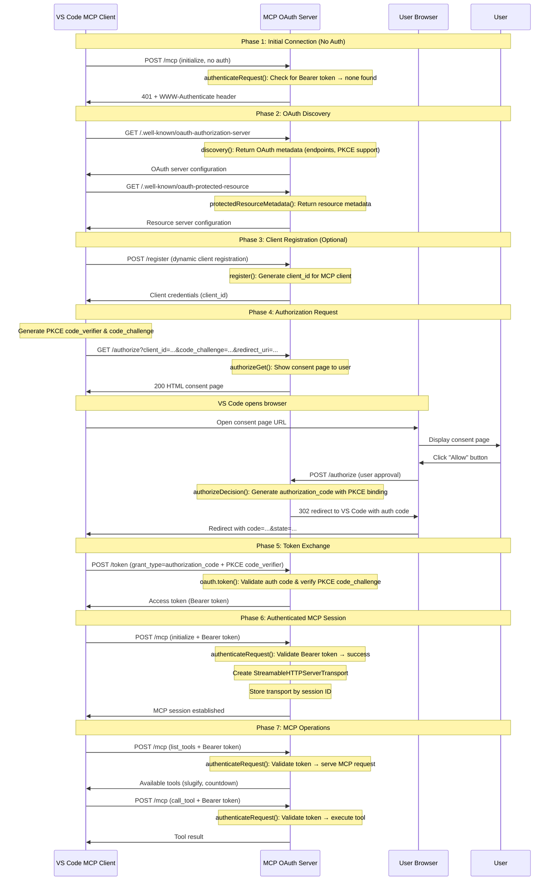

## OAuth 2.1 + PKCE Flow Sequence Diagram

Here's what happens when VS Code (or another MCP client) connects to our OAuth-protected MCP server:

<!-- todo: Recommend a mermaid diagram plugin. VScode supports no diagramming languages by default. - ex: Markdown Preview Mermaid Support -->



<!-- TODO: Missing the "problem" & "verify" sections. & need more than just the diagram for the background info section.  -->

## Solution

The OAuth 2.1 + PKCE authentication system is already implemented in the `src/auth/` folder. You only need to integrate it into your existing HTTP server.

### Update HTTP Server (`src/http-server.ts`)

Add OAuth authentication to your existing HTTP server from step 7 with these changes:

```diff
#!/usr/bin/env -S node --import ./loader.mjs
import express from 'express';
import { StreamableHTTPServerTransport } from "@modelcontextprotocol/sdk/server/streamableHttp.js";
import { createMcpServer } from "./mcp-server.js";
+ import { addOAuthToApp } from "./auth/oauth-wrapper.js";

const app = express();

// Middleware
app.use(express.json());
app.use(express.urlencoded({ extended: false }));

- // Add CORS headers
+ // Add CORS headers FIRST
app.use((req, res, next) => {
  res.header('Access-Control-Allow-Origin', '*');
  res.header('Access-Control-Allow-Methods', 'GET, POST, DELETE, OPTIONS');
-   res.header('Access-Control-Allow-Headers', 'Content-Type, Authorization, Mcp-Session-Id, MCP-Protocol-Version');
+   res.header('Access-Control-Allow-Headers', 'Content-Type, Authorization, Mcp-Session-Id, MCP-Protocol-Version, WWW-Authenticate');
+   res.header('Access-Control-Expose-Headers', 'WWW-Authenticate');

  if (req.method === 'OPTIONS') {
    res.sendStatus(200);
    return;
  }
  next();
});

+ // Add OAuth endpoints and authentication AFTER CORS
+ addOAuthToApp(app);

// Map to store transports by session ID
const transports: Record<string, StreamableHTTPServerTransport> = {};

// ... rest of the existing code remains unchanged
```

**Key Changes:**

1. **Line 5**: Import `addOAuthToApp` from the OAuth wrapper
2. **Line 13**: Update comment to emphasize CORS comes first
3. **Line 17**: Add `WWW-Authenticate` header to CORS configuration for OAuth responses
4. **Line 18**: Add `Access-Control-Expose-Headers` so browsers can read the WWW-Authenticate header
5. **Lines 26-27**: Add OAuth endpoints and authentication middleware after CORS

That's it! The OAuth authentication system will now protect all `/mcp` routes.

## Next Steps

Congratulations! 🎉 You've completed the full MCP training journey.
You're now ready to build amazing MCP integrations!
