CP NOTES: We need to do the following (this is not a complete list):


- What's the easist way to support a PKCE authorization? Ideally, we'd give folks some package that can be configured to show a simple input that could be matched against an environment variable. If there's a match, a new session will be established. 
- Add a sequence diagram explaining what happens.  The following can be used for inspiration.  It's more complex as it diagrams a PKCE flow where a server acts as a bridge between a PKCE auth flow and atlassian's traditional oath flow: 

```mermaid
sequenceDiagram
    participant VSCode as VS Code MCP Client
    participant Bridge as Auth Bridge Server
    participant Browser as User Browser
    participant Atlassian as Atlassian Platform

    Note over VSCode,Atlassian: Phase 1: Initial Connection (No Auth)
    VSCode->>Bridge: POST /mcp (initialize, no auth)
    Note over Bridge: mcp-service.js::handleMcpPost()
    Note over Bridge: → mcp-service.js::getAuthInfoFromBearer() → null
    Bridge->>VSCode: 401 + WWW-Authenticate header

    Note over VSCode,Atlassian: Phase 2: OAuth Discovery & Authorization
    VSCode->>Bridge: GET /.well-known/oauth-authorization-server
    Note over Bridge: pkce/discovery.ts::oauthMetadata()
    Bridge->>VSCode: OAuth server metadata

    VSCode->>Bridge: GET /authorize (PKCE params)
    Note over Bridge: pkce/authorize.ts::authorize()
    Note over Bridge: → Store PKCE state in session
    Bridge->>VSCode: 302 → Atlassian OAuth URL

    Note over VSCode,Browser: VS Code opens browser
    VSCode->>Browser: Open https://auth.atlassian.com/authorize/...
    Browser->>Atlassian: User login & consent
    Note over Browser,Atlassian: User sees Atlassian login page<br/>Grants permissions to app
    Atlassian->>Browser: 302 → Bridge callback URL + auth code
    Browser->>Bridge: GET /callback?code=...&state=...
    Note over Bridge: pkce/callback.ts::callback()
    Note over Bridge: → Validate state, redirect to VS Code
    Bridge->>Browser: 302 → vscode://localhost:33418?code=...&state=...
    Browser->>VSCode: Redirect to VS Code with auth code

    Note over VSCode,Atlassian: Phase 3: Token Exchange
    VSCode->>Bridge: POST /access-token (PKCE + auth code)
    Note over Bridge: pkce/access-token.ts::accessToken()
    Note over Bridge: → atlassian-auth-code-flow.js::exchangeCodeForTokens()
    Bridge->>Atlassian: POST /oauth/token (token exchange)
    Atlassian->>Bridge: Access + Refresh tokens
    Note over Bridge: → pkce/token-helpers.ts::createJiraMCPAuthToken()
    Bridge->>VSCode: JWT containing Atlassian tokens

    Note over VSCode,Atlassian: Phase 4: MCP Session Establishment
    VSCode->>Bridge: POST /mcp (initialize + JWT auth)
    Note over Bridge: mcp-service.js::handleMcpPost()
    Note over Bridge: → mcp-service.js::getAuthInfoFromBearer() → JWT validation
    Note over Bridge: → tokens.js::jwtVerify()
    Note over Bridge: → Create StreamableHTTPServerTransport
    Note over Bridge: → jira-mcp/index.js::setAuthContext()
    Bridge->>VSCode: MCP initialize response + session-id

    VSCode->>Bridge: POST /mcp (notifications/initialized)
    Note over Bridge: mcp-service.js::handleMcpPost()
    Note over Bridge: → Reuse existing transport
    Bridge->>VSCode: Success

    VSCode->>Bridge: GET /mcp (establish SSE)
    Note over Bridge: mcp-service.js::handleSessionRequest()
    Note over Bridge: → Validate auth for SSE stream
    Bridge->>VSCode: SSE connection established

    Note over VSCode,Atlassian: Phase 5: Tool Discovery & Execution
    VSCode->>Bridge: POST /mcp (tools/list)
    Note over Bridge: mcp-service.js::handleMcpPost()
    Note over Bridge: → MCP SDK routes to jira-mcp/index.js
    Note over Bridge: → Returns registered tools
    Bridge->>VSCode: 202 Accepted (async processing)
    Bridge->>VSCode: Tool list response (via SSE/HTTP)

    VSCode->>Bridge: POST /mcp (tools/call get-accessible-sites)
    Note over Bridge: mcp-service.js::handleMcpPost()
    Note over Bridge: → MCP SDK routes to tool handler
    Note over Bridge: → jira-mcp/tool-get-accessible-sites.js::handler()
    Note over Bridge: → jira-mcp/auth-helpers.js::getAuthInfoSafe()
    Note over Bridge: → Extract Atlassian token from context
    Bridge->>Atlassian: GET /oauth/token/accessible-resources
    Atlassian->>Bridge: Site list + Jira data
    Bridge->>VSCode: Tool execution result
```



- We should explain that many open source MCP services simply use authorization headers. 


- If PKCE is too complex, we can check authorization headers against an environment variable. Here's some example code:


```ts
function sendMissingAccessToken(res: Response, req: Request, where: string = 'bearer header'): Response {
  const message = `Authentication token missing access token in ${where}.`;
  console.log(`❌🔑 ${message}`);
  return res
      .status(401)
      .header('WWW-Authenticate', createWwwAuthenticate(req, message))
      .header('Cache-Control', 'no-cache, no-store, must-revalidate')
      .header('Pragma', 'no-cache')
      .header('Expires', '0')
      .json({
        jsonrpc: '2.0',
        error: {
          code: -32001,
          message: message,
        },
        id: req.body?.id || null,
      });
}
```

```ts
/**
 * Generate WWW-Authenticate header value according to RFC 6750 and RFC 9728
 * with VS Code Copilot compatibility handling
 * 
 * @param req - Express request object (used for client detection)
 * @param errorDescription - Optional error description for invalid_token errors
 * @param errorCode - Optional error code (defaults to "invalid_token" when errorDescription provided)
 * @returns Complete WWW-Authenticate header value
 * 
 * Specifications:
 * - RFC 6750 Section 3: WWW-Authenticate Response Header Field
 * - RFC 9728 Section 5.1: WWW-Authenticate Resource Metadata Parameter (resource_metadata)
 * - VS Code Copilot Extension: Non-standard resource_metadata_url parameter
 * 
 * Implementation Note:
 * VS Code breaks when it sees both resource_metadata and resource_metadata_url parameters.
 * We detect VS Code clients and only send the parameter they expect:
 * - VS Code: Only resource_metadata_url (their non-standard parameter)
 * - Other clients: Only resource_metadata (RFC 9728 standard)
 * See specs/vs-code-copilot/readme.md for details.
 */
function createWwwAuthenticate(req: Request, errorDescription: string | null = null, errorCode: string = 'invalid_token'): string {
  const metadataUrl = `${process.env.VITE_AUTH_SERVER_URL}/.well-known/oauth-protected-resource`;
  
  let authValue = `Bearer realm="mcp"`;
  
  // Add error parameters if provided (RFC 6750 Section 3.1)
  if (errorDescription) {
    authValue += `, error="${errorCode}", error_description="${errorDescription}"`;
  }
  
  // Add appropriate resource metadata parameter based on client type
  if (isVSCodeClient(req)) {
    // VS Code Copilot expects resource_metadata_url (non-standard)
    authValue += `, resource_metadata_url="${metadataUrl}"`;
  } else {
    // Standard RFC 9728 parameter for other clients
    authValue += `, resource_metadata="${metadataUrl}"`;
  }
  
  return authValue;
}
```


```ts
/**
 * Detect if the client is VS Code based on User-Agent and MCP client info
 * 
 * @param req - Express request object
 * @returns True if client is VS Code
 */
function isVSCodeClient(req: Request): boolean {
  // Check User-Agent header - VS Code sends "node"
  const userAgent = req.headers['user-agent'];
  if (userAgent === 'node') {
    return true;
  }
  
  // Check MCP initialize request clientInfo
  if (req.body && req.body.method === 'initialize' && req.body.params && req.body.params.clientInfo) {
    const clientName = req.body.params.clientInfo.name;
    if (clientName === 'Visual Studio Code') {
      return true;
    }
  }
  
  return false;
}
```


```ts
export async function handleMcpPost(req: Request, res: Response): Promise<void> {
  console.log('======= POST /mcp =======');
  console.log('Headers:', JSON.stringify(sanitizeHeaders(req.headers)));
  console.log('Body:', JSON.stringify(req.body));
  console.log('mcp-session-id:', req.headers['mcp-session-id']);
  console.log('--------------------------------');

  // Check for existing session ID
  const sessionId = req.headers['mcp-session-id'] as string | undefined;
  let transport: StreamableHTTPServerTransport;

  if (sessionId && transports[sessionId]) {
    // Reuse existing transport
    transport = transports[sessionId];
    console.log(`  ♻️ Reusing existing transport for session: ${sessionId}`);
  } 
  else if (!sessionId && isInitializeRequest(req.body as JSONRPCRequest)) {
    // New initialization request
    console.log('  🥚 New MCP initialization request.');

    // Extract and validate auth info
    let { authInfo, errored } = await getAuthInfoFromBearer(req, res);
    if (errored) { return; }

    if (!authInfo) {
      ({ authInfo, errored } = await getAuthInfoFromQueryToken(req, res));
    }
    if (errored) { return; }
    
    if (!authInfo) {
      sendMissingAccessToken(res, req, 'anywhere');
      return;
    }
    console.log('    Has valid token, creating streamable transport');
    transport = new StreamableHTTPServerTransport({
      sessionIdGenerator: () => randomUUID(),
      onsessioninitialized: (newSessionId: string) => {
        // Store the transport by session ID
        console.log(`    Storing transport for new session: ${newSessionId}`);
        transports[newSessionId] = transport;
        // Store auth context for this session
        setAuthContext(newSessionId, authInfo!);
      },
    });

    // Clean up transport when closed
    transport.onclose = () => {
      if (transport.sessionId) {
        console.log(`.   Cleaning up session: ${transport.sessionId}`);
        delete transports[transport.sessionId];
        clearAuthContext(transport.sessionId);
      }
    };

    // Connect the MCP server to this transport
    await mcp.connect(transport);
    console.log('    MCP server connected to new transport');
  } else {
    // Invalid request
    console.log('  ❌ Invalid MCP request - no session ID and not an initialize request');
    res.status(400).json({
      jsonrpc: '2.0',
      error: {
        code: -32000,
        message: 'Bad Request: No valid session ID provided',
      },
      id: null,
    });
    return;
  }

  // Handle the request with authentication error interception
  try {
    await transport.handleRequest(req, res, req.body);
  } catch (error) {
    // Check if this is an MCP OAuth authentication error
    if (error instanceof InvalidTokenError) {
      console.log('MCP OAuth authentication expired - sending proper OAuth 401 response');
      
      const wwwAuthValue = createWwwAuthenticate(req, error.message);
      
      res.set('WWW-Authenticate', wwwAuthValue);
      res.set('Cache-Control', 'no-cache, no-store, must-revalidate');
      res.set('Pragma', 'no-cache');
      res.set('Expires', '0');
      res.status(401).json(error.toResponseObject());
      return;
    }
    
    // Re-throw other errors
    throw error;
  }
  console.log('  ✅ MCP POST request handled successfully');
}
```
