## OAuth 2.1 + PKCE Flow Sequence Diagram

Here's what happens when VS Code (or another MCP client) connects to our OAuth-protected MCP server:

```mermaid
sequenceDiagram
    participant VSCode as VS Code MCP Client
    participant Server as MCP OAuth Server
    participant Browser as User Browser
    participant User as User

    Note over VSCode,User: Phase 1: Initial Connection (No Auth)
    VSCode->>Server: POST /mcp (initialize, no auth)
    Note over Server: oauth.authenticate(): Check for Bearer token → none found
    Server->>VSCode: 401 + WWW-Authenticate header

    Note over VSCode,User: Phase 2: OAuth Discovery
    VSCode->>Server: GET /.well-known/oauth-authorization-server
    Note over Server: discovery(): Return OAuth metadata (endpoints, PKCE support)
    Server->>VSCode: OAuth server configuration

    VSCode->>Server: GET /.well-known/oauth-protected-resource
    Note over Server: protectedResourceMetadata(): Return resource metadata
    Server->>VSCode: Resource server configuration

    Note over VSCode,User: Phase 3: Client Registration (Optional)
    VSCode->>Server: POST /register (dynamic client registration)
    Note over Server: register(): Generate client_id for MCP client
    Server->>VSCode: Client credentials (client_id)

    Note over VSCode,User: Phase 4: Authorization Request
    Note over VSCode: Generate PKCE code_verifier & code_challenge
    VSCode->>Server: GET /authorize?client_id=...&code_challenge=...&redirect_uri=...
    Note over Server: authorizeGet(): Show consent page to user
    Server->>VSCode: 200 HTML consent page

    Note over VSCode,Browser: VS Code opens browser
    VSCode->>Browser: Open consent page URL
    Browser->>User: Display consent page
    User->>Browser: Click "Allow" button
    Browser->>Server: POST /authorize (user approval)
    Note over Server: authorizeDecision(): Generate authorization_code with PKCE binding
    Server->>Browser: 302 redirect to VS Code with auth code
    Browser->>VSCode: Redirect with code=...&state=...

    Note over VSCode,User: Phase 5: Token Exchange
    VSCode->>Server: POST /token (grant_type=authorization_code + PKCE code_verifier)
    Note over Server: oauth.token(): Validate auth code & verify PKCE code_challenge
    Server->>VSCode: Access token (Bearer token)

    Note over VSCode,User: Phase 6: Authenticated MCP Session
    VSCode->>Server: POST /mcp (initialize + Bearer token)
    Note over Server: oauth.authenticate(): Validate Bearer token → success
    Note over Server: Create StreamableHTTPServerTransport
    Note over Server: Store transport by session ID
    Server->>VSCode: MCP session established

    Note over VSCode,User: Phase 7: MCP Operations
    VSCode->>Server: POST /mcp (list_tools + Bearer token)
    Note over Server: oauth.authenticate(): Validate token → serve MCP request
    Server->>VSCode: Available tools (slugify, countdown)

    VSCode->>Server: POST /mcp (call_tool + Bearer token)
    Note over Server: oauth.authenticate(): Validate token → execute tool
    Server->>VSCode: Tool result
```



## Solution

Here's the complete OAuth 2.1 + PKCE implementation for MCP servers:

### 1. Install OAuth Dependencies

```bash
npm install @node-oauth/express-oauth-server @node-oauth/oauth2-server
```

### 2. OAuth Model (`src/auth/oauth-model.ts`)

```typescript
import crypto from "crypto";

// In-memory storage - we'll store clients dynamically
const clients = new Map();
const authorizationCodes = new Map();
const accessTokens = new Map();

export default {
  async getClient(clientId: string, clientSecret?: string) {
    console.log("Getting client:", clientId);

    // Use a placeholder URI but rely on validateRedirectUri for actual validation
    const client = {
      id: clientId,
      grants: ["authorization_code"],
      redirectUris: ["DYNAMIC"], // Placeholder - actual validation in validateRedirectUri
    };

    clients.set(clientId, client);
    console.log("Auto-created client with dynamic redirect URI validation");
    return client;
  },

  // Override to validate any redirect URI
  async validateRedirectUri(redirectUri: string, client: any) {
    return true; // Accept any redirect URI for maximum compatibility
  },

  async saveAuthorizationCode(code: any, client: any, user: any) {
    authorizationCodes.set(code.authorizationCode, {
      authorizationCode: code.authorizationCode,
      expiresAt: code.expiresAt,
      redirectUri: code.redirectUri,
      scope: code.scope,
      client: client,
      user: user,
      codeChallenge: code.codeChallenge,
      codeChallengeMethod: code.codeChallengeMethod,
    });
    return code;
  },

  async getAuthorizationCode(authorizationCode: string) {
    const code = authorizationCodes.get(authorizationCode);
    console.log(
      "Getting authorization code:",
      authorizationCode,
      "found:",
      !!code
    );
    return code || null;
  },

  async revokeAuthorizationCode(code: any) {
    console.log("Revoking authorization code:", code.authorizationCode);
    authorizationCodes.delete(code.authorizationCode);
    return true;
  },

  async generateAccessToken(client: any, user: any, scope: any) {
    const token = crypto.randomBytes(32).toString("hex");
    console.log(
      "Generated access token for client:",
      client?.id,
      "user:",
      user?.id
    );
    return token;
  },

  async saveToken(token: any, client: any, user: any) {
    console.log("Saving token for client:", client?.id, "user:", user?.id);
    const savedToken = {
      accessToken: token.accessToken,
      accessTokenExpiresAt: token.accessTokenExpiresAt,
      scope: token.scope,
      client: client,
      user: user,
    };

    accessTokens.set(token.accessToken, savedToken);
    console.log("Token saved successfully");
    return savedToken;
  },

  async getAccessToken(accessToken: string) {
    const token = accessTokens.get(accessToken);
    if (!token) return null;

    // Check if token is expired
    if (token.expiresAt && token.expiresAt < new Date()) {
      accessTokens.delete(accessToken);
      return null;
    }

    return token;
  },

  async verifyScope(token: any, scope: string[]) {
    return true; // Simplified for training
  },
};
```

### 3. OAuth Server Configuration (`src/auth/oauth-server.ts`)

```typescript
import OAuthServer from "@node-oauth/express-oauth-server";
import model from "./oauth-model.js";

export const oauth = new OAuthServer({
  model: model,
  requireClientAuthentication: {
    authorization_code: false, // PKCE replaces client secret
  },
  allowBearerTokensInQueryString: true,
  accessTokenLifetime: 3600,
  authorizationCodeLifetime: 600,
  addAcceptedScopesHeader: false,
  addAuthorizedScopesHeader: false,
  allowExtendedTokenAttributes: false,
  useErrorHandler: false,
  continueMiddleware: false,
});
```

### 4. OAuth Handlers (`src/auth/oauth-handlers.ts`)

```typescript
import express from "express";
import crypto from "crypto";
import { oauth } from "./oauth-server.js";
import model from "./oauth-model.js";

export function discovery(req: express.Request, res: express.Response) {
  res.json({
    issuer: "http://localhost:3000",
    authorization_endpoint: "http://localhost:3000/authorize",
    token_endpoint: "http://localhost:3000/token",
    registration_endpoint: "http://localhost:3000/register",
    code_challenge_methods_supported: ["S256"],
    response_types_supported: ["code"],
    grant_types_supported: ["authorization_code", "refresh_token"],
    token_endpoint_auth_methods_supported: ["none", "client_secret_post"],
    scopes_supported: [],
  });
}

export function protectedResourceMetadata(
  req: express.Request,
  res: express.Response
) {
  const baseUrl = "http://localhost:3000";
  res.json({
    resource: baseUrl,
    authorization_servers: [baseUrl],
    scopes_supported: [],
    bearer_methods_supported: ["header", "body"],
    resource_documentation: `${baseUrl}/.well-known/oauth-authorization-server`,
  });
}

export function authorizeGet(req: express.Request, res: express.Response) {
  try {
    console.log("Authorization GET request:", req.query);

    const { client_id, redirect_uri, code_challenge, code_challenge_method } =
      req.query;
    const state = req.query.state || "default";

    const consentPage = `
      <!DOCTYPE html>
      <html>
      <head><title>MCP Demo - Authorize</title></head>
      <body>
        <h1>Authorize MCP Demo Client</h1>
        <p>MCP Demo Client wants to access your account.</p>
        
        <form method="post">
          <input type="hidden" name="client_id" value="${client_id}">
          <input type="hidden" name="redirect_uri" value="${redirect_uri}">
          <input type="hidden" name="code_challenge" value="${code_challenge}">
          <input type="hidden" name="code_challenge_method" value="${code_challenge_method}">
          <input type="hidden" name="state" value="${state}">
          <input type="hidden" name="response_type" value="code">
          <button type="submit" name="authorize" value="true" style="background: green; color: white; padding: 10px 20px; margin: 5px;">Allow</button>
          <button type="submit" name="authorize" value="false" style="background: red; color: white; padding: 10px 20px; margin: 5px;">Deny</button>
        </form>
      </body>
      </html>
    `;

    res.send(consentPage);
  } catch (error) {
    console.error("Authorization GET error:", error);
    res.status(500).json({ error: "Authorization failed" });
  }
}

export function authorizeDecision(req: express.Request, res: express.Response) {
  if (req.body.authorize !== "true") {
    const redirectUri = req.body.redirect_uri;
    const state = req.body.state;
    return res.redirect(`${redirectUri}?error=access_denied&state=${state}`);
  }

  // Redirect to internal authorization endpoint
  const authUrl = new URL("http://localhost:3000/oauth/authorize-internal");
  authUrl.searchParams.set("client_id", req.body.client_id);
  authUrl.searchParams.set("redirect_uri", req.body.redirect_uri);
  authUrl.searchParams.set("code_challenge", req.body.code_challenge);
  authUrl.searchParams.set(
    "code_challenge_method",
    req.body.code_challenge_method
  );
  authUrl.searchParams.set("state", req.body.state || "default");
  authUrl.searchParams.set("response_type", "code");

  res.redirect(authUrl.toString());
}

export function callback(req: express.Request, res: express.Response) {
  const { code, state, error } = req.query;

  if (error) {
    res.send(`<h1>Authorization Failed</h1><p>Error: ${error}</p>`);
    return;
  }

  res.send(`
    <h1>Authorization Successful</h1>
    <p>Authorization code: <code>${code}</code></p>
    <p>You can now close this window and return to your application.</p>
  `);
}

export function register(req: express.Request, res: express.Response) {
  try {
    const clientMetadata = req.body;
    const clientId = `mcp_${crypto.randomUUID()}`;

    const registrationResponse = {
      client_id: clientId,
      client_id_issued_at: Math.floor(Date.now() / 1000),
      redirect_uris: clientMetadata.redirect_uris || [
        "http://localhost:3000/callback",
      ],
      grant_types: ["authorization_code"],
      response_types: ["code"],
      token_endpoint_auth_method: "none",
      scope: "",
    };

    console.log("Registered new MCP client:", clientId);
    res.status(201).json(registrationResponse);
  } catch (error) {
    console.error("Client registration failed:", error);
    res.status(400).json({
      error: "invalid_client_metadata",
      error_description:
        error instanceof Error ? error.message : "Invalid client metadata",
    });
  }
}
```

### 5. OAuth Wrapper (`src/auth/oauth-wrapper.ts`)

```typescript
import express from "express";
import { oauth } from "./oauth-server.js";
import {
  discovery,
  authorizeGet,
  authorizeDecision,
  protectedResourceMetadata,
  callback,
  register,
} from "./oauth-handlers.js";

export function addOAuthToApp(app: express.Application) {
  // OAuth discovery endpoints
  app.get("/.well-known/oauth-authorization-server", discovery);
  app.get("/.well-known/oauth-protected-resource", protectedResourceMetadata);

  // Authorization endpoints
  app.get("/authorize", authorizeGet);
  app.post("/authorize", authorizeDecision);

  // Internal authorization endpoint using OAuth middleware
  app.get(
    "/oauth/authorize-internal",
    oauth.authorize({
      authenticateHandler: {
        handle: () => ({ id: "demo-user" }),
      },
    })
  );

  // Token and other endpoints
  app.post("/token", oauth.token());
  app.get("/callback", callback);
  app.post("/register", register);

  // Add authentication to MCP routes
  app.use("/mcp", oauth.authenticate());

  return app;
}
```

### 6. Update HTTP Server (`src/http-server.ts`)

Changes to integrate OAuth into your existing HTTP server from step 7:

```diff
#!/usr/bin/env -S node --import ./loader.mjs
import express from 'express';
import { StreamableHTTPServerTransport } from "@modelcontextprotocol/sdk/server/streamableHttp.js";
import { createMcpServer } from "./mcp-server.js";
+ import { addOAuthToApp } from "./auth/oauth-wrapper.js";

const app = express();

// Middleware
app.use(express.json());
app.use(express.urlencoded({ extended: false }));

- // Add CORS headers
+ // Add CORS headers FIRST
app.use((req, res, next) => {
  res.header('Access-Control-Allow-Origin', '*');
  res.header('Access-Control-Allow-Methods', 'GET, POST, DELETE, OPTIONS');
-   res.header('Access-Control-Allow-Headers', 'Content-Type, Authorization, Mcp-Session-Id, MCP-Protocol-Version');
+   res.header('Access-Control-Allow-Headers', 'Content-Type, Authorization, Mcp-Session-Id, MCP-Protocol-Version, WWW-Authenticate');

  if (req.method === 'OPTIONS') {
    res.sendStatus(200);
    return;
  }
  next();
});

+ // Add OAuth endpoints and authentication AFTER CORS
+ addOAuthToApp(app);

// Map to store transports by session ID
const transports: Record<string, StreamableHTTPServerTransport> = {};
```

**Key Changes:**

1. **Line 5**: Import `addOAuthToApp` from the OAuth wrapper
2. **Line 13**: Update comment to emphasize CORS comes first
3. **Line 17**: Add `WWW-Authenticate` header to CORS configuration for OAuth responses
4. **Lines 25-26**: Add OAuth endpoints and authentication middleware after CORS

📁 **Reference Implementation**: [training/9-authorizing-mcp/src/http-server.ts](./9-authorizing-mcp/src/http-server.ts#L5,L13,L17,L25-L26)

### 7. Test the Implementation

1. **Start the server**: `npm run dev:http`
2. **Connect from VS Code**: The OAuth flow will automatically start when VS Code tries to connect.

The OAuth 2.1 + PKCE implementation provides secure authentication while accepting any redirect URI for maximum compatibility.

## Next Steps

Congratulations! 🎉 You've completed the full MCP training journey.
You're now ready to build amazing MCP integrations!
